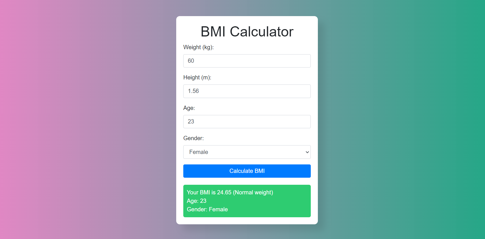
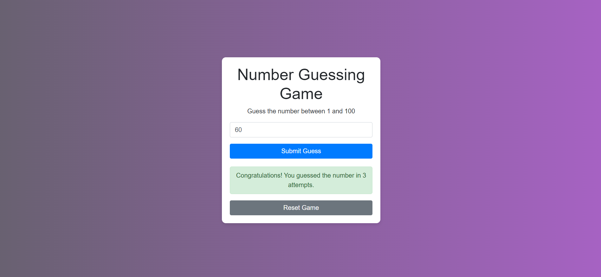
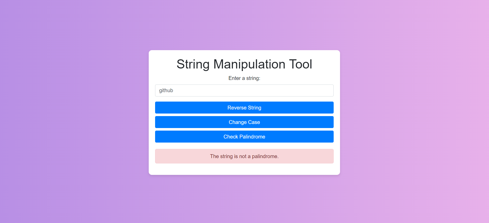
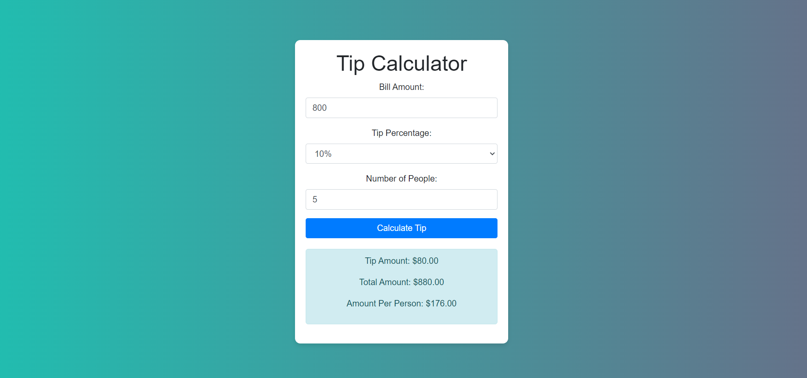

# My JavaScript Projects

This repository contains several JavaScript projects I have worked on. Each project is self-contained and demonstrates various programming concepts and techniques, such as operators, if-else statements, and switch cases. Below is a brief description of each project along with instructions on how to run them.

## Table of Contents

1. [BMI Calculator](#bmi-calculator)
2. [Number Game](#number-game)
3. [String Manipulation](#string-manipulation)
4. [Tip Calculator](#tip-calculator)
5. [Traffic Light](#traffic-light)

## BMI Calculator

### Description
The BMI (Body Mass Index) Calculator is a simple tool that calculates the BMI based on the user's weight and height. It then categorizes the BMI into different health ranges using JavaScript operators and if-else statements.

### How to Run
1. Clone the repository: git clone https://github.com/Vaibhavii3/javaScript_projects
2. Navigate to the project directory: cd BMI
3. Open index.html in a web browser.

## Number Game

### Description
The Number Game is an interactive game where the user tries to guess a randomly generated number within a certain range. The game provides feedback using JavaScript if-else statements to help the user guess the number.

### How to Run
1. Clone the repository: git clone https://github.com/Vaibhavii3/javaScript_projects
2. Navigate to the project directory: cd Number_Game
3. Open index.html in a web browser.

## String Manipulation

### Description
The String Manipulation project contains various functions that perform different operations on strings, such as reversing a string, changing case, and finding substrings using JavaScript string methods and operators.

### How to Run
1. Clone the repository: git clone https://github.com/Vaibhavii3/javaScript_projects
2. Navigate to the project directory: cd String
3. Open index.html in a web browser.

## Tip Calculator

### Description
The Tip Calculator is a simple program that calculates the amount of tip to be given based on the total bill amount and the desired tip percentage using JavaScript operators and if-else statements.

### How to Run
1. Clone the repository: git clone https://github.com/Vaibhavii3/javaScript_projects
2. Navigate to the project directory: cd Tip_calculator
3. Open index.html in a web browser.

## Traffic Light

### Description
The Traffic Light project simulates a traffic light system, changing colors at regular intervals to mimic the operation of a real traffic light using JavaScript switch cases and setInterval function.

### How to Run
1. Clone the repository: git clone https://github.com/Vaibhavii3/javaScript_projects
2. Navigate to the project directory: cd Traffic light
3. Open index.html in a web browser.

## Contributing
If you would like to contribute to this repository, feel free to fork the project and submit a pull request.

